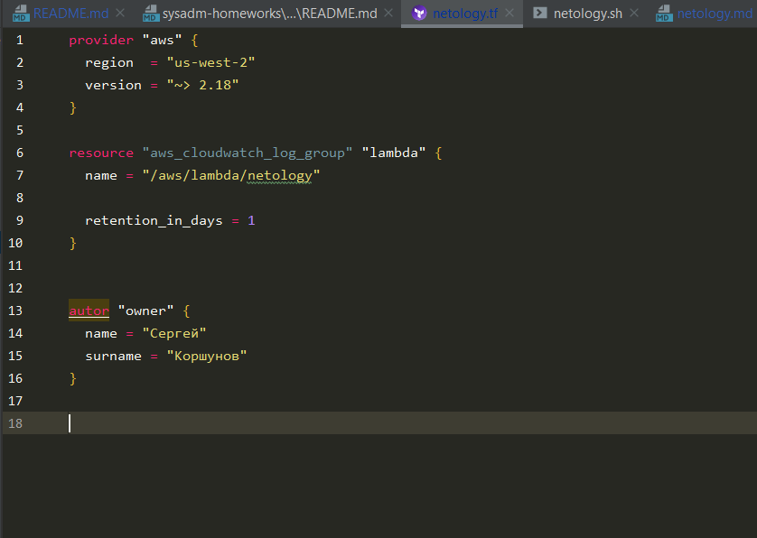
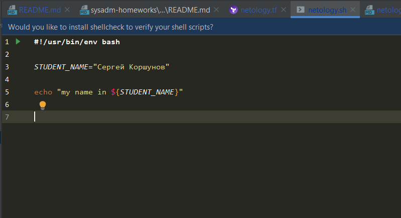
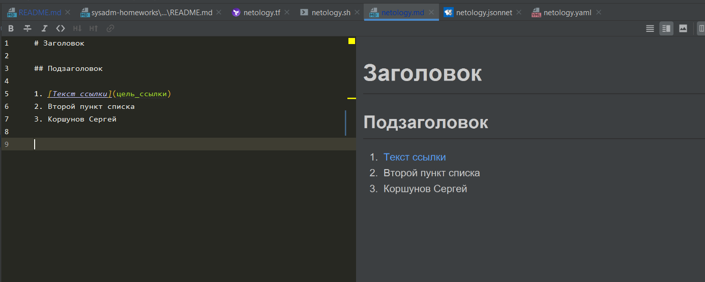
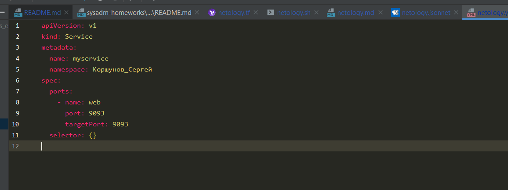
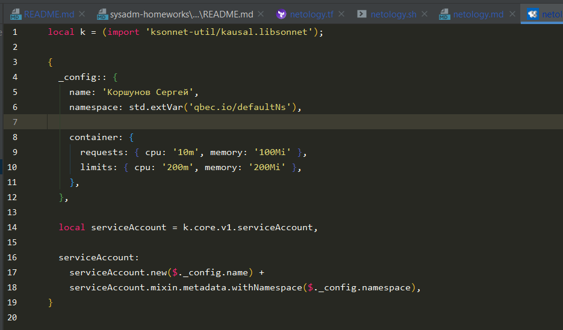

# Домашнее задание к занятию «1.1. Введение в DevOps»

## Задание №1 - Подготовка рабочей среды

1. Вот, что у меня получилось:
    - Terraform: 
    - Bash: 
    - Markdown: 
    - Yaml: 
    - Jsonnet: 
1. Добавьте свое имя в каждый файл, сделайте снимок экрана и загрузите его на любой сервис обмена картинками.
1. Ссылки на картинки:
https://b.radikal.ru/b17/2108/dd/94768ee89d45.png
https://c.radikal.ru/c42/2108/44/0ccbc134cbf8.png
https://d.radikal.ru/d14/2108/4d/30a9835d4629.png
https://c.radikal.ru/c36/2108/99/2ccc1bd445b8.png
https://a.radikal.ru/a27/2108/24/0d49c3eb6e7d.png

## Задание №2 - Описание жизненного цикла задачи (разработки нового функционала)

Чтобы лучше понимать предназначение дальнейших инструментов, с которыми нам предстоит работать, давайте 
составим схему жизненного цикла задачи в идеальном для вас случае.

### Описание истории

Представьте, что вы работаете в стартапе, который запустил интернет-магазин. Ваш интернет-магазин достаточно успешно развивался, и вот пришло время налаживать процессы: у вас стало больше конечных клиентов, менеджеров и разработчиков.Сейчас от клиентов вам приходят задачи, связанные с разработкой нового функционала. Задач много, и все они требуют выкладки на тестовые среды, одобрения тестировщика, проверки менеджером перед показом клиенту. В случае необходимости, вам будет необходим откат изменений. 

### Решение задачи

Вам необходимо описать процесс решения задачи в соответствии с жизненным циклом разработки программного обеспечения. Использование какого-либо конкретного метода разработки не обязательно. Для решения главное - прописать по пунктам шаги решения задачи (релизации в конечный результат) с участием менеджера, разработчика (или команды разработчиков), тестировщика (или команды тестировщиков) и себя как DevOps-инженера. 

### Мой ответ

1. Разработчики должны определиться со средой разработки и в дальнейшем придерживаться её. Они также должны использовать систему контроля версий и написать оптимальное логирование.
1. Менеджер ставит задачи перед разработчиками и расставляет приоритеты по задачам.
1. Разработчики пишут код и тесты на девелоперском стенде и после отладки формируют релиз.
1. DevOps инженер пишет реализацию автоматической или полуавтоматической выкладки релиза на тест, препрод и прод, а также реализацию отката кода из VCS и восстановления БД из регулярно создающегося бэкапа.
1. Тестировщики прогоняют тесты на тестовом контуре, это могут быть автотесты в переспективе.
Если тесты не успешны, то релиз возвращается на исправление багов разработчикам.
1. Если тесты прошли успешно, то выполняется деплой на препрод(тест с боевой БД). Менеджер на препроде демонстрирует функционал заказчику, выслушивает замечания.
Если от заказчика поступают критические замечания, то менеджер возвращает релиз на доработку разработчикам.
1. Если заказчик принимает функционал на препроде, то релиз выкатывается на продуктовую среду по ранее написанному сценарию DevOps инженером.
1. В случае, если возникли проблемы при выкате релиза на бой или наблюдается серьезная деградация сервиса после выката, выполнить откат.
1. Новый функционал обкладывается точками мониторинга, за которым следит команда эксплуатации(админы). По возможности стараниями DevOps инженера создание точек мониторинга может быть автоматизировано.
1. В случае, если всё прошло успешно, и всё работает как нужно, эксплуатация выполняет рестор БД с продакшна на препрод и тест. По возможности DevOps инженер может автоматизировать данный процесс.

